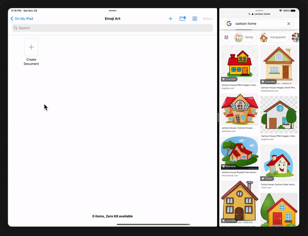
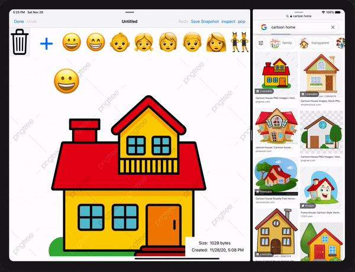

# Emoji Art (From Stanford Lectures)

# discreption

### use apple document manager to navigate and manipulate app documents you can drag an image from anywhere and add emojis to the image and you can change the position and the size of the emoji the document will be auto-saved always and have a redo and undo features and you can save an image with one click and you can save the work over the Icloud to continue work from any device you can add and delete any emojis or characters from the emoji list or form the document and also redo and undo them

 

# Technologies
* scroll view (ability to zoom the image in and out)
* collection View (to present the emojis)
* drag and drop (image and emojis from the collection View)
* document view and document manager (to manipulate the document)
* animations